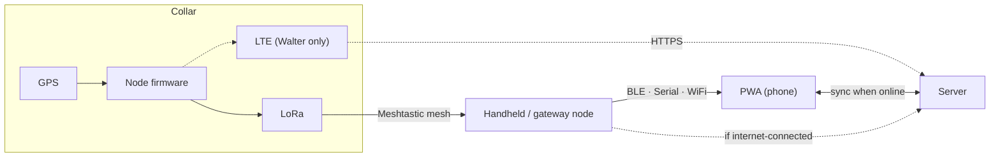

# FetchFido — Technical Design

**Status:** Draft v0.1 · 2026-08-01
**Companion to:** [PRD.md](PRD.md)

The layer below the PRD: architecture, wire protocol, identity, storage, and API.
Written to be implementable; where a claim needs checking against current
upstream behaviour it is marked **[verify]**.

---

## 1. Principles

1. **The phone works with no server.** The server is a sync target, never a
   dependency for live tracking.
2. **Airtime is the scarcest resource.** Every byte on LoRa costs range,
   battery, and cadence. Design the wire format first, everything else second.
3. **Prefer stock over custom.** Anything requiring custom collar firmware is a
   cost. Where stock Meshtastic behaviour suffices, use it.
4. **Degrade in defined steps.** Mesh → LTE → last-known. Each state is a
   first-class UI state, not an error.

## 2. Overview



Three ingest paths, one record type. The PWA is a first-class consumer of the
mesh directly; the server is a second consumer that also serves history.

## 3. Radio and wire protocol

### 3.1 Decision: collars are stock Meshtastic nodes in v1

A collar transmits **native Meshtastic `POSITION_APP` packets** (portnum 3) —
the same thing any Meshtastic node with a GPS already emits. No custom firmware
in v1.

Rationale:

- Any Meshtastic node with GPS becomes a collar. This directly serves "anyone
  can use this, whether or not they have a mesh."
- Zero firmware maintenance, and no fork to keep rebasing on upstream.
- Existing community mesh infrastructure relays it without modification.
- Firmware bring-up is removed from the critical path, so Phase 1 is pure app
  work against hardware that already functions.

Costs, accepted for v1:

- No per-device authentication beyond the channel PSK (see §3.3).
- No on-collar geofence evaluation (see §8).
- No custom telemetry fields beyond what Meshtastic already carries.

A custom portnum in the `PRIVATE_APP` range (256+) **[verify]** is the upgrade
path when those costs stop being acceptable. Design the server ingest to accept
both from day one so the migration is additive.

### 3.2 Airtime budget

Meshtastic's max data payload is ~237 bytes **[verify]**; we will use a small
fraction. A `Position` protobuf carrying lat, lon, time, and altitude runs
roughly 20–30 bytes, plus ~16 bytes of mesh header — call it **40–50 bytes on
the wire**.

At LongFast (~1.0 kbps), 50 bytes ≈ **0.4 s of airtime** per transmission,
before flood rebroadcasts. With rebroadcast multiplication, budget **~1.2 s of
channel occupancy per position per collar**.

Channel utilisation target: **stay under 25%**. Above that, collision and
retransmission make effective throughput fall as offered load rises.

```
cadence_floor ≈ (collars × 1.2 s) / 0.25
```

| Collars | LongFast floor | MediumFast floor |
|---|---|---|
| 2 | ~10 s | ~3 s |
| 6 | ~29 s | ~8 s |
| 12 | ~58 s | ~16 s |

This is the arithmetic behind the PRD's cadence table. **Two dogs on a private
channel is a genuinely different product from twelve** — the single-dog owner
gets near-real-time tracking, which is worth surfacing in the UI rather than
applying one conservative default to everyone.

**Adaptive cadence** is therefore the main lever:

| State | Interval |
|---|---|
| Stationary (< 10 m drift) | 300 s |
| Moving | 30 s |
| Boundary crossed / just escalated | 10 s, decaying |

Stock Meshtastic's smart-position-broadcast covers part of this **[verify]**;
the rest is a firmware concern deferred with §3.1.

### 3.3 Authentication

The threat is not an outsider — the channel PSK handles that. It is **a member
of your own mesh spoofing another collar's node ID**, and a hostile actor
posting fabricated positions to the server over the internet.

**Ed25519 signatures do not fit on LoRa.** A 64-byte signature on a 50-byte
packet nearly triples airtime, and airtime is the whole budget. Split the paths:

| Path | Mechanism | Overhead |
|---|---|---|
| Mesh (v1) | Channel PSK only | 0 bytes |
| Mesh (v2, custom portnum) | Truncated HMAC-SHA256, 8 bytes, per-device key | 8 bytes |
| LTE → server | Ed25519 signature over the report | 64 bytes, irrelevant on cellular |
| Phone → server sync | Session token; phone attests what it heard | — |

An 8-byte truncated MAC is not a full-strength signature, but it raises forgery
from trivial to impractical at a cost of 16% more airtime, which is the right
trade on this link. Full signatures where bandwidth is free; truncated MAC where
it is not.

Server-side: a position arriving over the phone-sync path is marked
`provenance: mesh_unverified` and is **not** treated as equivalent to a
`provenance: device_signed` LTE report. The UI should not visually distinguish
them, but audit and abuse handling must.

## 4. Device identity and provisioning

- **Identifier:** the Meshtastic node ID (`!a1b2c3d4`) in v1, since that is what
  the mesh already carries. Server-side devices carry an internal UUID so the
  identifier can change without breaking history.
- **Claiming:** QR code encodes `{node_id, device_pubkey, claim_nonce}`. The
  phone scans it, registers with the server (or stores locally in serverless
  mode), and binds the device to a dog profile.
- **Keys:** generated on-device where firmware permits; otherwise generated at
  provisioning and written to the device. For v1 stock nodes there is no device
  key — claiming binds a node ID only, and the record is marked accordingly.
- **Self-host default:** accept any device on the configured channel; claiming
  is a naming convenience, not a gate. **SaaS:** claiming is mandatory.

## 5. Client (PWA)

### 5.1 Transports

Use **`@meshtastic/js`** rather than reimplementing the protobuf layer — it
provides BLE, Serial, and HTTP transports against the same connection interface
**[verify current API surface]**.

```
interface CollarSource {
  connect(): Promise<void>
  onPosition(cb: (p: Position) => void): void
  status(): 'connected' | 'degraded' | 'offline'
}
```

Four implementations: `BleSource`, `SerialSource`, `WifiSource`, `ServerSource`.
The UI binds only to `CollarSource` and never learns which is active — that
distinction belongs in a status indicator, not in application logic.

Platform matrix is in PRD §7.1. The load-bearing constraint: **iOS gets
`WifiSource` or `ServerSource` only**, and `WifiSource` requires an ESP32-class
node.

### 5.2 Map and offline tiles

**MapLibre GL JS** with **PMTiles** — a single-file tile archive served over
HTTP range requests, and cacheable whole for offline use. Avoids running a tile
server, which matters for self-hosters.

Pre-hunt flow: pick an area, download the PMTiles region, store in Cache
Storage. The app must state plainly what is cached and what is not; discovering
you have no basemap in the field is a product failure.

### 5.3 Local store

IndexedDB, authoritative for the current session:

- `positions` — keyed `(device_id, timestamp)`, the dedupe key. Mesh flooding
  delivers duplicates and out-of-order packets as normal operation, not error.
- `devices`, `dogs`, `geofences`
- `outbox` — positions heard over mesh but not yet synced

Sync is one-way push of `outbox` plus one-way pull of history. No merge conflict
exists: positions are immutable facts stamped by the device.

### 5.4 Freshness

Every position carries `age = now - timestamp`. The UI degrades in defined
steps — fresh, stale, lost — rather than showing an unqualified marker. The
failure mode this prevents is a handler acting on a five-minute-old position
believing it to be current.

Clock trust: use the **GPS-derived timestamp** from the device, not phone
receive time. Mesh relay delay is real and variable.

## 6. Server

### 6.1 Storage

**SQLite via `modernc.org/sqlite`** (pure Go) for self-host; Postgres for SaaS,
behind one repository interface.

The pure-Go driver is not incidental: the existing build is
`CGO_ENABLED=0 -ldflags '-extldflags "-static"'` into a scratch container, and
`mattn/go-sqlite3` requires cgo. Keeping the static-scratch build is worth
choosing the driver around.

### 6.2 Model

```
tenants(id, name)                          -- absent in single-tenant mode
users(id, tenant_id, email, ...)
dogs(id, tenant_id, name, colour)
devices(id, tenant_id, dog_id, node_id, pubkey, claimed_at)
positions(device_id, ts, lat, lon, alt, speed, heading,
          battery, provenance, link)       -- PK (device_id, ts)
geofences(id, tenant_id, kind, geometry, active)
events(id, device_id, ts, kind, detail)    -- crossings, link loss, low battery
```

`positions` is append-only and by far the largest table; partition or roll off by
time. Retention is a **default-short, user-configurable** setting per PRD §9.

### 6.3 API

```
POST /api/v1/ingest          device-signed report (LTE path)
POST /api/v1/sync            bulk upload from phone outbox
GET  /api/v1/devices
GET  /api/v1/positions?device=&from=&to=
WS   /api/v1/live            server-push for connected clients
POST /api/v1/devices/claim
GET  /api/v1/export?format=gpx|csv
```

Ingest is rate-limited per device. `/sync` is idempotent on `(device_id, ts)`.

### 6.4 Multi-tenancy

One binary. `SINGLE_TENANT=true` (self-host default) skips auth entirely and
omits `tenant_id` from queries. Tenant isolation is enforced in the repository
layer, not in handlers, so a missing check cannot leak across tenants.

## 7. LTE path (Walter)

The Walter (ESP32-S3 + Sequans LTE-M) is the only collar variant needing custom
firmware in v1.

- Escalate per PRD §6 policy; power the modem only when escalating.
- Report over HTTPS to `/api/v1/ingest`, Ed25519-signed.
- **Batch on reconnect.** A collar out of contact for twenty minutes holds a
  queue; sending forty individual reports is worse than one batch in both power
  and cost.
- De-escalate on hearing any mesh neighbour.

Per-collar SIM data cost is a real SaaS input — measure bytes per report early.

## 8. Where geofences are evaluated

The PRD wants on-collar evaluation so containment works with no connectivity.
That requires custom firmware, which §3.1 defers.

| Phase | Evaluated | Consequence |
|---|---|---|
| 1 | Phone | Works only while phone hears the mesh |
| 2 | Phone + server | Server covers LTE-connected collars |
| 3 | Collar | True offline containment |

Phase 1's limitation must be stated in-product. A containment feature that
silently stops working when the phone is out of range is worse than no feature.

## 9. Build and deployment

Carry forward what already works: multi-stage build, static binary, scratch
container, rootless Podman, non-root UID.

New: the PWA is a static bundle. Serve it from the same Go binary via
`embed.FS` so self-hosting stays a single artifact with no separate web server.

## 10. Phase 1 deliverables

1. PWA shell with `CollarSource` and a working `BleSource`.
2. MapLibre + PMTiles offline basemap.
3. IndexedDB position store with `(device_id, ts)` dedupe.
4. Live map: markers, breadcrumb tracks, **position age**, distance and bearing.
5. No server, no auth, no geofence.

Success criterion: walk a node around and watch it track, with the phone in
airplane mode.

## 11. Field test hooks

Hardware is available, so the PRD §13 range test can run alongside Phase 1. Build
these in early — they are cheap now and expensive to retrofit:

- Log **RSSI and SNR** with every received position.
- Log **hop count** to distinguish direct reception from relayed.
- Record **gaps** (expected vs received) as the real range metric — packet
  delivery ratio matters more than a maximum-distance number.
- Export a session as GPX **plus** the RSSI/PDR series, so range degradation can
  be plotted against terrain.

The question to answer: at what distance, at 40 cm off the ground, in timber,
does packet delivery fall below usable? That single curve drives preset defaults,
cadence, and whether mesh-only is viable at all.

## 12. Open technical questions

1. Does stock Meshtastic smart-broadcast give adequate adaptive cadence, or is
   custom firmware needed sooner than §3.1 assumes? **[verify]**
2. Flood-routing behaviour with 8–12 *moving* nodes — mesh churn is the
   untested case.
3. PMTiles region size for a realistic hunting area versus phone storage.
4. `@meshtastic/js` API stability and its BLE reliability on Android.
5. Battery: GPS duty cycle is the dominant draw; measure before promising hours.
6. Whether truncated-HMAC (§3.3) is worth its 16% airtime cost, or whether
   mesh-path spoofing is an acceptable v1 risk given the PSK.
