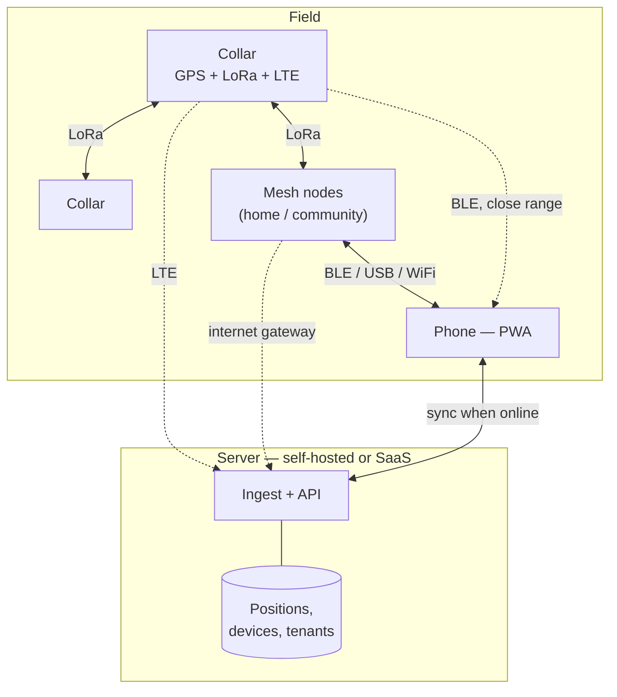

# FetchFido — Product Requirements Document

**Status:** Draft v0.2 · 2026-08-01
**Owner:** echosyp
**Licence:** MIT

An open-source, self-hostable dog tracker. Collars report over LoRa mesh, LTE,
or both; a phone shows where your dog is. No subscription required, no vendor
cloud required, and a hosted option for people who'd rather not run a server.

---

## 1. Problem

Dog tracking today splits into two unsatisfying options.

**Consumer LTE trackers** (Tractive, Fi, Whistle) are affordable up front but
require a mandatory subscription, route all location data through a vendor
cloud, and stop working entirely where there's no cell coverage. When the
company folds or changes terms, the hardware is scrap.

**Garmin's Alpha ecosystem** is excellent and works off-grid, but it costs well
past $1,000, is closed and unrepairable, and is purpose-built for hunting.

Neither can be self-hosted. Neither lets you keep your own data. Neither works
if you want it to run over a radio network you already own.

FetchFido targets the gap: an open tracker that works **with or without cell
service**, **with or without a mesh network**, and **with or without our
server**.

## 2. Positioning

This is explicitly **not** a 1:1 Garmin Alpha competitor. Matching a
2.5-second update rate over VHF is not achievable on LoRa, and chasing it would
distort the product. FetchFido is aimed at the general dog owner first, with
working-dog handlers as a welcome and well-served secondary audience.

| | Consumer LTE trackers | Garmin Alpha | **FetchFido** |
|---|---|---|---|
| Up-front cost | Low | Very high | Low–moderate |
| Subscription | Mandatory | None | **Optional** |
| Works without cell | No | Yes | **Yes, with mesh** |
| Self-hostable | No | N/A | **Yes** |
| Open / repairable | No | No | **Yes** |
| Real-time pursuit | No | Excellent | Limited |

The honest summary: **FetchFido is built for finding a dog, not for chasing
one.** Those are different problems and they need different update rates.

## 3. Goals

1. Track collars on a phone with **no assumptions about connectivity** — cell,
   mesh, both, or neither-but-in-BLE-range all degrade gracefully.
2. Work with zero infrastructure for someone who has none, and get better for
   someone who runs a mesh.
3. Self-host completely: your server, your data, no account.
4. Offer the same software hosted, for people who don't want to operate it.
5. Build v1 on off-the-shelf hardware anyone can replicate.

## 4. Non-goals (v1)

| Excluded | Why |
|---|---|
| Real-time pursuit tracking | LoRa airtime can't sustain it. Serving it badly is worse than not claiming it. |
| Training stimulation (e-collar) | Liability, fail-safe burden, legally restricted in several jurisdictions. |
| Activity states (on-point, treed, bark) | IMU work plus per-breed tuning. Strongest v2 candidate. |
| Custom collar PCB | v1 validates software and RF on existing boards. See §10 — this is the main gap between v1 and the stated market. |
| EU / 868 MHz | Out of scope for now. The 1% duty cycle materially cuts achievable cadence and deserves its own design pass. |
| Garmin interoperability | Proprietary radio. Not achievable. |

## 5. Users

**Primary — the dog owner.** One or two dogs. Wants to know where the dog went
when it got out, and to be told promptly that it *has* got out. Will not flash
firmware, will not solder, and will abandon setup that takes more than fifteen
minutes. Cost-sensitive, and actively hostile to another monthly subscription.

**Secondary — the self-hoster.** Already runs a homelab. Wants the server on
their own hardware and their data under their own control. Comfortable with
containers and happy to assemble a collar.

**Tertiary — the working-dog handler.** Hunting, SAR, field trials. Multiple
dogs, routinely beyond cell coverage, most demanding cadence requirements. Gets
the most benefit from mesh and tolerates the most DIY. Not the design centre,
but explicitly not excluded.

## 6. Connectivity model

The defining design decision: **the collar is link-agnostic.** It supports LoRa
mesh and LTE, and a user-selectable policy decides how they're used. There is no
single "correct" configuration, because the right answer differs completely
between a suburban pet owner and a hound handler in a national forest.

| Policy | Behaviour | Fits |
|---|---|---|
| **LTE only** | Cellular always. Simplest; needs a SIM. | Owner with no mesh — the default for most people |
| **LTE preferred** | Cellular when available, mesh when not. | Suburban owner who also runs nodes |
| **Mesh preferred** | Mesh when reachable; escalate to LTE when orphaned. | Handler working off-grid; minimises SIM data cost |
| **Mesh only** | No cellular at all. No SIM, no recurring cost. | Privacy-focused, or property-scale coverage |

Escalation between links is automatic within the chosen policy. A "mesh
preferred" collar that hears no neighbour for a configurable window (default ~3
cycles) powers the modem, reports, and de-escalates once mesh returns — LTE
costs far more power.

**Where mesh comes from.** Three cases, all supported: the user's own nodes
(house, barn, truck); other collars relaying for each other; and existing
community Meshtastic networks, which now blanket many metro areas. The third is
free infrastructure the user doesn't own — genuinely valuable, and worth noting
that traffic transits third-party hardware. Payload encryption covers content;
it does not hide that a device is present. Document this rather than bury it.

**The gap to state plainly:** no mesh *and* no cell means no live position. The
last known position, its age, and the direction of travel are then the entire
product, and must be treated as first-class rather than a fallback screen.

### 6.1 What update rate is actually needed?

| Scenario | Needed cadence | Served? |
|---|---|---|
| Dog got out, recover it | 30–60 s | **Well** |
| Escape alert from yard/boundary | Alert latency, not cadence | **Well** |
| Monitoring a dog working a field | 15–30 s | Adequately |
| Pursuing a running hound in timber | 2–5 s | **Poorly** |

Meshtastic's LongFast preset carries roughly 1 kbps, and flood routing means
neighbours rebroadcast every packet. A handful of collars realistically lands at
45–60 seconds per report; faster presets buy cadence and cost range.

*Approximate; verify against current firmware.*

| Preset | ~Bitrate | Range | Cadence, several collars |
|---|---|---|---|
| LongFast (default) | ~1.0 kbps | Best | 45–60 s |
| MediumSlow | ~2.0 kbps | Good | 30–45 s |
| MediumFast | ~3.5 kbps | Moderate | 15–25 s |
| ShortFast | ~11 kbps | Poor | 5–10 s |

Expose this as "Long range / Balanced / Fast updates" with the tradeoff stated,
rather than hiding it in a default.

Design consequences:
- **Adaptive cadence** — report faster when moving or when a boundary state
  changes, slow down when stationary.
- **Always show position age.** A 50-second-old position rendered as current is
  actively harmful.
- **Breadcrumbs, not just a pin.** A track makes a one-minute cadence usable in
  a way a single stale marker never is.

### 6.2 Range reality

LoRa at 915 MHz penetrates foliage and diffracts around terrain worse than the
~151 MHz VHF Garmin uses, and a collar rides ~40 cm off the ground on a moving
animal — close to a worst-case antenna position. In timber, expect
collar-to-handheld range well short of an Alpha. Mesh relaying through other
nodes partially compensates and is a real advantage over Garmin's star
topology, but only when nodes are within relay distance.

For the primary use case — a dog loose in a neighbourhood, tracked via LTE or
city mesh — this matters far less than it does for the tertiary one.

## 7. Architecture

### 7.1 Phone client

A PWA with a transport abstraction over the Meshtastic protobuf protocol, so one
UI works across every link:

| Transport | Browser API | Works on |
|---|---|---|
| BLE | Web Bluetooth | Android Chrome. **Not iOS Safari.** |
| USB serial | Web Serial | Desktop Chrome, Android via OTG. **Not iOS.** |
| WiFi / TCP | fetch / WebSocket | Everywhere, **including iOS** |
| Server API | HTTPS | Everywhere, needs internet |

**WiFi-to-node is the only local transport that works on iPhone**, and it needs
an ESP32-class node — nRF52 boards (T-Echo, RAK4631) have no WiFi. The hardware
guide must say so before an iOS user buys the wrong board. iOS users with no
mesh are fully served by the server API path.

Requirements: offline map tiles cached in advance; state in IndexedDB; the
server is a **sync target, not a dependency**.

### 7.2 Server

Ingest paths: direct LTE reports, mesh-gateway forwarding, and bulk phone sync
when coverage returns. All write the same records, deduplicated on
`(device_id, timestamp)`.

One binary for both deployments. Single-tenant mode disables registration and
skips the tenant layer, so a self-hoster never manages accounts they don't want.

## 8. Functional requirements

### 8.1 Registration
- Claim a collar by scanning a QR code carrying device ID and public key.
- Name it, assign a dog profile and map colour.
- Reject positions from unclaimed devices.
- **Setup must be completable by a non-technical user in under fifteen minutes**,
  including the connectivity policy choice in §6.

### 8.2 Live tracking
- Map with one marker per dog, colour-coded, showing heading.
- **Position age on every marker**, visually degraded past a threshold.
- Distance and bearing from handler to dog.
- Breadcrumb track per session, configurable retention.
- Explicit per-collar link status: mesh / LTE / stale.

### 8.3 Geofence and containment
- **Static boundary** drawn on a map, and **dynamic radius** around the moving
  handler. Static matters most for the primary user; dynamic for the tertiary.
- **Evaluated on the collar**, so it works with no connectivity; boundaries
  pushed to the device and cached. Re-evaluated on the phone as a cross-check.
- Alerts on: crossing out, crossing back, and loss of contact — which in
  practice is the earliest signal a dog is leaving.
- Alerts are audio plus vibration. Not a toast notification.

### 8.4 Final approach *(candidate, v2)*
GPS gets you to ~5 m. For the last stretch — dog under a porch, in brush — use
**BLE RSSI from the collar as a proximity meter**. The radio is already there
and it directly serves the primary use case's last and most frustrating minute.

### 8.5 Export
GPX and CSV per dog per session, in both deployments. No lock-in.

## 9. Security and privacy

The current prototype accepts unauthenticated UDP from anyone — fine for a LAN
toy, disqualifying for a product.

- **Per-device identity.** Each collar holds a keypair and signs its reports.
  Meshtastic's channel PSK authenticates the *channel*, not the device, and
  cannot stop a member of your own mesh from spoofing a collar. App-layer
  signing is required on top.
- **Source-IP filtering is not viable.** Verified in the field: real device
  traffic arrives from public internet addresses through a port forward, so it
  is indistinguishable from hostile traffic at the network layer. Authentication
  must be payload-level.
- **A dog's location is its owner's location.** This is the most sensitive thing
  the product holds — it maps a home address and a daily routine. Encrypt at
  rest, default to short retention, make deletion real.
- Community mesh relaying means packets transit third-party nodes. Encrypt
  payloads; disclose the metadata exposure.
- Per-device ingest rate limits to bound a compromised collar.

## 10. The hardware gap

v1 uses an off-the-shelf node in a printed enclosure. That serves the self-hoster
and the working-dog handler, who will happily assemble one.

**It does not serve the primary user.** Someone who wants to find their dog will
not flash firmware or 3D print a case, and a printed box on a nylon strap will
not survive a dog that swims, rolls, and drags it through brush.

This is a real gap between v1's hardware and the stated market, and it should be
named rather than glossed. v1 exists to prove the software and the radio with
people who tolerate rough edges. **Reaching the primary user requires the custom
PCB** — potted, IP67, sensible battery, antenna tuned in the strap. Sequencing
that after software validation is correct; forgetting it is not.

## 11. Self-host vs SaaS

| | Self-host | SaaS |
|---|---|---|
| Server | Yours | Hosted |
| Accounts | None | Required |
| Collar SIM | Bring your own | Bundled |
| Retention | Your choice | Tiered |
| Cost | Hardware only | Subscription |

**Same code, no feature-gating.** The open version is not crippled to sell the
hosted one; hosting sells convenience and bundled connectivity. Anything else
poisons the community that makes open hardware viable.

## 12. Phasing

1. **Mesh + LTE tracking, no server.** Collar node, PWA, live map, breadcrumbs.
   Proves the hard part.
2. **Server and sync.** Self-hosted ingest, history, export, claiming.
3. **Connectivity policies.** Full §6 policy matrix and escalation logic.
4. **Geofence and alerts.** On-collar evaluation, boundary push.
5. **SaaS.** Multi-tenancy, billing, bundled SIMs.
6. **Custom hardware.** The §10 gap.

Phase 1 is deliberately serverless: if the radio doesn't hold up on a moving
dog, that should surface before any backend exists.

## 13. Open questions

1. **Range on a moving dog at 40 cm.** Field-test before anything else.
2. Battery life at target cadence including LTE bursts.
3. Weight and bulk — acceptable on a 50 lb dog, likely not on a beagle.
4. Does Meshtastic flood routing hold up with 8–12 moving nodes, or is a custom
   LoRa mode needed? Keep it on the table.
5. SIM sourcing and per-collar data cost — directly sets SaaS pricing.
6. Waterproofing to a real standard. Dogs swim.

## 14. Relationship to the current codebase

Little survives. The UDP listener, in-memory store, and server-rendered Go
templates were built for a single-user LAN demo; this is offline-first,
multi-device, and authenticated. **Treat it as a rewrite.**

Carrying over: the deployment approach (scratch container, rootless Podman,
minimal image), the GPS parsing and CSV export, and the operational lessons
already paid for — port 9999 collides with LAN broadcast traffic, container NAT
masks source IPs, in-memory state dies on restart.

## 15. Naming and licensing

- Project licence: **MIT**.
- "Garmin", "Alpha", and "TT" are Garmin trademarks. Describe FetchFido as an
  open alternative; never imply compatibility or endorsement.
- Meshtastic firmware is GPL-3.0 and "Meshtastic" is a registered trademark with
  published usage guidelines — review before branding anything as
  Meshtastic-compatible. Note MIT application code linking a GPL-3.0 firmware
  stack needs care about what is distributed together.
